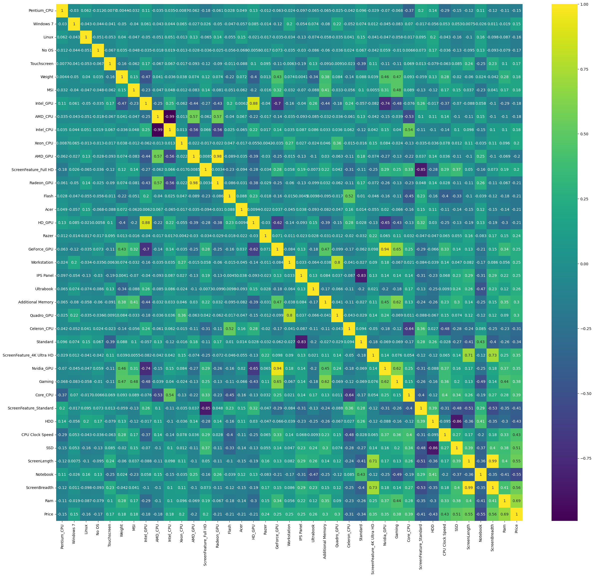
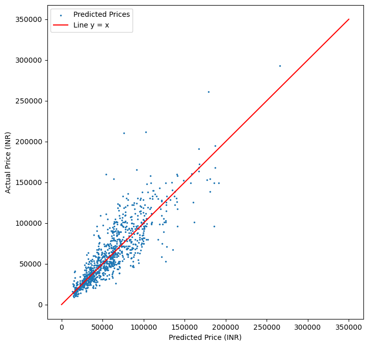

# Laptop Price Prediction

This project aims to predict laptop prices based on various features extracted from a dataset of laptop specifications. The project involves data preprocessing, feature engineering, and building a predictive model using machine learning techniques.

## Table of Contents

- [Introduction](#introduction)
- [Dataset](#dataset)
- [Data Preprocessing](#data-preprocessing)
  - [1. Handling Missing Values](#1-handling-missing-values)
  - [2. Cleaning Columns](#2-cleaning-columns)
  - [3. Processing 'ScreenResolution' Column](#3-processing-screenresolution-column)
  - [4. Processing 'Cpu' Column, 'Gpu' Column and 'Memory' Column](#4-processing-cpu-column-gpu-column-and-memory-column)
  - [5. Final Dataset](#5-final-dataset)
- [Modeling](#modeling)
  - [1. One-Hot Encoding](#1-one-hot-encoding)
  - [2. Feature Selection](#2-feature-selection)
  - [3. Data Visualization](#3-data-visualization)
  - [4. Model Training](#4-model-training)
  - [5. Model Evaluation](#5-model-evaluation)
- [Conclusion](#conclusion)
- [How to Run](#how-to-run)

## Introduction

Accurately predicting laptop prices can assist consumers in making informed purchasing decisions and help retailers optimize their pricing strategies. This project involves preprocessing a dataset containing laptop specifications and building a machine learning model to predict laptop prices.

## Dataset

The dataset contains various specifications of laptops, including:

- Company
- Type
- Screen size and resolution
- CPU and GPU details
- RAM and storage specifications
- Operating system
- Weight
- Price

**Note**: Due to confidentiality, the dataset is not included in this repository. Ensure you have access to the dataset file named `laptopData.csv`.

## Data Preprocessing

The raw data was cleaned and transformed to ensure it was suitable for machine learning. Key steps included:

### 1. Handling Missing Values

- **Checking for Missing Values**: We identify missing values in each column.

  ```python
  missing_values = dataset.isnull().sum()
  missing_percentage = dataset.isnull().mean() * 100
  ```

- **Dropping Rows with Missing Values**: Since missing values occur in entire rows, we drop those rows.

  ```python
  dataset.dropna(axis=0, inplace=True)
  ```

### 2. Cleaning Columns

- **Removing Units from 'Ram' and 'Weight' Columns**: We remove units to convert these columns into numerical data.

  ```python
  dataset['Ram'] = dataset['Ram'].str.replace("GB", "")
  dataset['Weight'] = dataset['Weight'].str.replace("kg", "")
  ```

### 3. Processing 'ScreenResolution' Column

- **Extracting Panel Type, Resolution, and Additional Features**:

  ```python
  def simplify_resolution(res):
      panel = re.search(r'(IPS Panel|Touchscreen)', res)
      panel = panel.group(0) if panel else 'Standard'

      resolution = re.search(r'\d{3,4}x\d{3,4}', res)
      resolution = resolution.group(0) if resolution else 'Unknown'

      feature = re.search(r'(Retina Display|4K Ultra HD|Full HD|Quad HD\+)', res)
      feature = feature.group(0) if feature else 'Standard'

      return f'{panel}, {feature}, {resolution}'

  dataset['SimplifiedResolution'] = dataset['ScreenResolution'].apply(simplify_resolution)
  ```

- **Splitting into Separate Columns**:

  ```python
  dataset[['Screen Panel Type', 'Additional Screen Features', 'Screen Resolution']] = dataset['SimplifiedResolution'].str.split(', ', expand=True)
  dataset.drop(columns=['ScreenResolution', 'SimplifiedResolution'], inplace=True)
  ```

### 4. Processing 'Cpu' Column, 'Gpu' Column and 'Memory' Column

I give here the exemple for the processing of 'Cpu' Column.

- **Extracting CPU Features**:

  ```python
  dataset['CPU Brand'] = dataset['Cpu'].apply(lambda x: x.split()[0])
  dataset['CPU Series'] = dataset['Cpu'].apply(lambda x: x.split()[1] if len(x.split()) > 1 else None)
  dataset['CPU Core Type'] = dataset['Cpu'].str.extract(r'(\b(?:Quad|Dual|Octa)?\b Core)', expand=False)
  dataset['CPU Model Number'] = dataset['Cpu'].str.extract(r'(\b[A-Za-z0-9\-]+[0-9]+\b)', expand=False)
  dataset['CPU Clock Speed'] = dataset['Cpu'].str.extract(r'(\d+\.\d+GHz)', expand=False)
  ```

- **Dropping the Original 'Cpu' Column**:

  ```python
  dataset.drop(columns=['Cpu'], inplace=True)
  ```

### 5. Final Dataset

After handling missing values and cleaning the data, we finalize the dataset.

```python
dataset.dropna(subset=['CPU Model Number', 'Gpu Type', 'Main Storage Type', 'Main Storage Size'], inplace=True)
```

- **Converting Data Types**:

  ```python
  dataset['Price'] = dataset['Price'].astype(int)
  dataset['Main Storage Size'] = dataset['Main Storage Size'].apply(convert).astype(int)
  dataset['Additional Storage Size'] = dataset['Additional Storage Size'].fillna('0GB')
  dataset['Additional Storage Size'] = dataset['Additional Storage Size'].apply(convert).astype(int)
  dataset['CPU Clock Speed'] = dataset['CPU Clock Speed'].str.replace('GHz', '').astype(float)
  ```

- **Saving the Cleaned Data**:

  ```python
  dataset.to_csv('edited_dataframe.csv', index=False)
  ```

## Modeling

For this project, I used python libraries including:

- numpy
- pandas
- matplotlib
- torch
- sklearn
- seaborn


### 1. One-Hot Encoding

One-hot encoding is a technique used to transform categorical data into a numerical format that machine learning models can understand. It creates binary (0 or 1) columns for each unique category in a categorical variable. This ensures that the model treats these categories as distinct and unrelated.

However, we need to be careful while one-hot encoding the CPU Brand and GPU Brand, because in certain instances they might share the same company. This would needlessly result in two identical columns, which might potentially confuse the machine learning model. To avoid this issue, we add prefixes as shown below.

- **Encoding Categorical Variables**:

  ```python
  df = df.join(pd.get_dummies(df['Company']))
  df.drop('Company', axis=1, inplace=True)

  df = df.join(pd.get_dummies(df['TypeName']))
  df.drop('TypeName', axis=1, inplace=True)

  df = df.join(pd.get_dummies(df['OpSys']))
  df.drop('OpSys', axis=1, inplace=True)

  # Encoding CPU and GPU Brands with prefixes to avoid confusion
  cpu_brands = pd.get_dummies(df['CPU Brand'], prefix='CPU_Brand')
  df = df.join(cpu_brands)
  df.drop('CPU Brand', axis=1, inplace=True)

  gpu_brands = pd.get_dummies(df['Gpu Brand'], prefix='GPU_Brand')
  df = df.join(gpu_brands)
  df.drop('Gpu Brand', axis=1, inplace=True)
  ```

Other Categorical Features are encoded too like the Screen Panel Type, the Gpu and Cpu series, the main storage type, etc.


### 2. Feature Selection

We have too many features, many of which might not be contribute very much to predicting the price of a laptop. We will identify the most relevant variables from the dataset to use in the model. The key steps for feature selection are:

- **Calculating Correlations**:

Correlations between the features and the target variable (Price) are calculated. Correlation measures the strength of the relationship between two variables, with values ranging from -1 to 1.
Features with high correlation values (positive or negative) to the target variable are likely to be more useful for prediction.

  ```python
  correlations = df.corr()['Price'].abs().sort_values()
  ```
This calculates the absolute value of the correlation between each feature and the target (Price), sorts the features, and identifies which are most strongly associated with Price.

- **Selecting Features with Correlation Above Threshold**:

Only features with correlations greater than 0.15 are retained for modeling.


The dataset is reduced to include only the selected features, simplifying the model and potentially improving performance by reducing noise.

### 3. Data Visualization

- **Heatmap of the selected features**:

A heatmap is useful for visualizing the correlation between features in a dataset: 
- Diagonal Values: These represent self-correlation, which is always 1.
- High Correlation (Close to 1): Indicates a strong positive relationship.
- Low Correlation (Close to -1): Indicates a strong negative relationship.
- Near Zero: Suggests little to no relationship.



### 4. Model Training

For this project, I choose to work with Random Forest.

Random Forest is an ensemble learning method based on decision trees.
It works by creating multiple decision trees during training and combining their predictions (averaging for regression or majority voting for classification).

Why Random Forest?

- Robustness: it reduces overfitting because individual trees are trained on different subsets of data and features.
- Handles Non-Linear Relationships: Random Forest can model complex, non-linear relationships between features and the target.
- Feature Importance: it provides a measure of feature importance, helping you understand which features contribute the most to predictions.

```python
  from sklearn.ensemble import RandomForestRegressor
  ```

- **Defining Features and Target Variable**:

  ```python
  X = selected_df.drop('Price', axis=1)
  y = selected_df['Price']
  ```

- **Splitting the Data**:

The dataset is split into two parts:
- Training Set: Used to train the model (learn patterns from the data).
- Testing Set: Used to evaluate how well the model performs on unseen data.
This ensures that the model generalizes to new, unseen data rather than simply memorizing the training data.

  ```python
  X_train, X_test, y_train, y_test = train_test_split(X, y, train_size=0.2, random_state=42)
  ```

- **Scaling the Data**:

Features often have different ranges (e.g., RAM might range from 4 to 64 GB, while Weight is between 1 and 3 kg). Scaling ensures that no single feature dominates due to its larger range.

  ```python
  scaler = StandardScaler()
  X_train_scaled = scaler.fit_transform(X_train)
  X_test_scaled = scaler.transform(X_test)
  ```
`fit_transform`: Computes scaling parameters (mean and standard deviation) and applies them to the training set.
`transform`: Applies the same scaling parameters to the test set to avoid data leakage.

- **Training the Random Forest Model**:

  ```python
  model = RandomForestRegressor()
  model.fit(X_train_scaled, y_train)
  ```

### 5. Model Evaluation

We evaluate the model to validate the model's accuracy and ensures it generalizes well beyond the training data.

- **Evaluating the Model**:

The R² Score measures how much of the variance in the target variable (Price) is explained by the model. Values closer to 1 indicate a better fit.

  ```python
  score = model.score(X_test_scaled, y_test)
  print(f'Model R^2 Score: {score}')
  ```
**Results**: Model R² Score: 0.74

- **Plotting Predicted vs. Actual Prices**:

This plot shows the model's accuracy:




## Conclusion

In this project, we successfully built a machine learning model to predict laptop prices based on various specifications. The data preprocessing stage involved cleaning and transforming the dataset, handling missing values, and extracting meaningful features from complex strings. In the modeling stage, we utilized a Random Forest Regressor, which achieved an R² score of approximately 0.74. The model can be further improved by experimenting with different algorithms, hyperparameter tuning, and feature engineering.

## How to Run

1. **Clone the Repository**:

   ```bash
   git clone https://github.com/vishrut-b/ML-Project-Laptop-Price-Prediction.git
   ```

2. **Navigate to the Project Directory**:

   ```bash
   cd your_repository
   ```

3. **Install Required Libraries**:

   Ensure you have Python 3.x installed. Install the necessary libraries:

   ```bash
   pip install pandas numpy matplotlib seaborn scikit-learn
   ```

4. **Prepare the Dataset**:

   - Place the `laptopData.csv` file in the project directory.
   - Run the data preprocessing script to generate `edited_dataframe.csv`.

     ```bash
     python data_processing.py
     ```

5. **Run the Modeling Script**:

   Execute the script to train the model and evaluate its performance.

   ```bash
   python learning.py
   ```

   Replace `data_preprocessing.py` and `learning.py` with the names of your scripts containing the above code.

---

**Note**: This README covers the data processing and modeling stages of the project. Further improvements, such as hyperparameter tuning and deployment, can be added in future updates.
